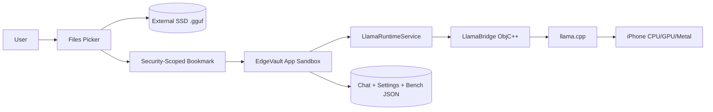

# EdgeVault LLM

Run GGUF models from external storage on iPhone.

## Problem Statement
Most on-device LLM demos copy large model files into phone storage. On iPhone 15 Plus, that can quickly consume internal space. EdgeVault LLM is designed so the GGUF file can stay on an external SSD while inference still runs locally on iPhone compute.

## Why This Is Useful
- Preserves iPhone internal storage
- Keeps inference local-first and privacy-first
- Makes model swapping easier via external media

## Architecture

## How External SSD Loading Works
1. User picks `.gguf` through iOS Files picker.
2. App opens URL in place, starts security-scoped access, validates readability.
3. App stores bookmark metadata + bookmark data only.
4. On launch, app restores bookmark and re-validates URL.
5. Model path is passed to llama.cpp bridge.

Default behavior does **not** copy model bytes into app storage.

## What App Can / Cannot Do
Can:
- Select `.gguf` from Files (external SSD supported)
- Persist bookmark and reopen later
- Load/unload model through native bridge API
- Run chat generation flow and benchmark logging

Cannot (yet):
- Guarantee all GGUF variants fit RAM
- Guarantee Metal acceleration in this scaffold without full macOS build steps
- Avoid RAM usage during inference (external SSD is not RAM)

## iPhone 15 Plus Limitations
- A16 class limits practical model size and throughput
- 1B to 1.7B Q4 models are realistic first targets
- 7B/8B models are usually too heavy for good UX

## Recommended Models
- Llama 3.2 1B Instruct Q4
- Qwen2.5 1.5B Instruct Q4_K_M
- SmolLM2 1.7B Instruct Q4_K_M

## Setup
1. Open `EdgeVaultLLM` in Xcode 15+ on macOS.
2. Create an iOS App target named `EdgeVaultLLM` (SwiftUI, Swift, iOS 17+).
3. Add all files under `EdgeVaultLLM/EdgeVaultLLM` into target.
4. Add `EdgeVaultLLM/EdgeVaultLLM/Runtime/LlamaBridge.mm` to Compile Sources.
5. Integrate llama.cpp (see `docs/LLAMA_CPP_INTEGRATION.md`).
6. Ensure Objective-C++ bridging headers are configured.
7. Build and run on iPhone 15 Plus (device test required for SSD workflow).

## External SSD Connection Notes
- Use USB-C SSD (exFAT or APFS recommended)
- Keep a simple folder layout:
  - `/LLM_MODELS/model.gguf`
- Keep SSD connected while model is loaded

## Select GGUF Model
- Home -> Select Model from External SSD
- Pick `.gguf`
- Confirm model metadata and bookmark status in Model Status

## Benchmark
- Open Benchmarks screen
- Run benchmark prompt:
  - "Explain what local AI inference means in simple terms."
- Export JSON from Settings

## Troubleshooting
See:
- `docs/TROUBLESHOOTING.md`
- `docs/IOS_EXTERNAL_STORAGE.md`
- `docs/LLAMA_CPP_INTEGRATION.md`

## Safety and Privacy
- No cloud backend
- No OpenAI API
- No Ollama runtime in iOS app
- Chat history and benchmark JSON remain local unless user exports

## Honest Limitations
- Native llama.cpp iOS toolchain integration requires macOS/Xcode setup
- mmap behavior can vary by URL/provider and iOS file-provider semantics
- Performance is model- and thermal-dependent

## Future Work
- Multiple bookmarks and model switcher
- Better streaming UX
- Side-by-side benchmark comparisons
- Optional Metal tuning presets
- Thermal and battery telemetry
